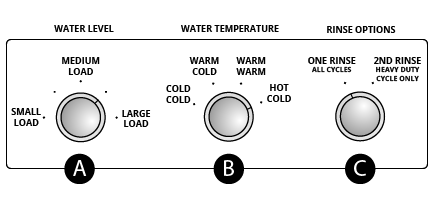

# How to Start the Washer

To get the maximum cleaning and fabric care from your washer, please read and follow these instructions.  
**Note:** The drawings in this section show the basic features of all models covered by this manual. Refer to the supplied "Feature Sheet" for your washer's particular features.  
**Warning:** Never place items in the washer that are dampened with gasoline or other flammable fluids. No washer can completely remove oil. Do not dry anything that has ever had any type of oil on it (including cooking oils). Failure to follow these instructions can result in death, explosion, or fire.

## Steps

1. Add measured detergent directly into the washer basket and place a load of sorted clothes in the washer.
1. (OPTIONAL STEP) If desired, add measured liquid chlorine bleach to the liquid bleach dispenser (if available); (see page).
1. (OPTIONAL STEP) If desired, add measured liquid fabric softener to the fabric softener dispenser (if available); (see page).
1. Close the washer lid.
1. Set WATER LEVEL control (A) based on the size of your wash load.
1. Set the WATER TEMPERATURE control (B).
1. Set RINSE OPTIONS control (if available) (C).
1. Push the START button.

**Figure 1: Washing Machine Dials**  

The washing machine has been started.
